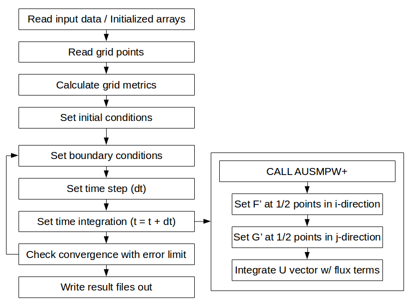

Code development
================

The present project is aimed to develop a computer program for solving 2-D unsteady Euler equations for a supersonic problem. Hereafter, the program developed here in this project is called '2DEuler'.

2DEuler Code summary
--------------------
The source code contains two directories, 'io', and 'main', for input/output related sources and main solver routines, respectively. 'CMakeLists.txt' file is also included for cmake compiling.

::

   $ cd 2DEuler/CODEdev/src/
   $ ls
   $ CMakeLists.txt  io  main

The **io** folder has **io.F90** and **ReadGrid.F90** files which contains subroutines for reading input/output data and grid info. It also includes **input** directory which contains a default **input.dat** file.

The **main** folder is only used for calculating essential subroutines required to solve the '2DEuler' equation by using 'AUSMPW+' scheme for solving flux reconstruction. The main routine is run by **main.F90** which calls important subroutines from **main** folder itself and **io** folder when needed.

Flow chart of 2DEuler code running
----------------------------------

The schematic below shows the flow chart of how the 2DEuler code runs. At the beggining of case running, the code reads the important parameters for grid information and numerical schemes. After then, it applies the proper initial conditions and set the variables to be applied to the main time loops.

In the main loop, the time-integration for updating flux vector :math:`\vec{U}` is made. It begins with applying the pre-specified boundary conditions and calculate the time-step (dt) for time-level update. The main part of this loop is made by calling 'AUSMPW+' flux splitting scheme.

